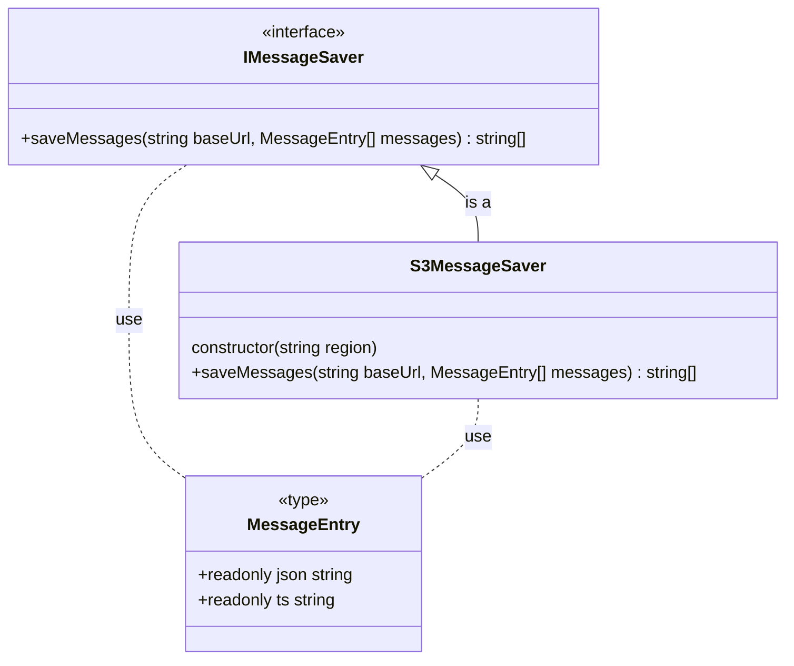

# ```msg-decoder``` package design

This package has to perform the task of transforming a class ```EachMessagePayload``` object
into an object of class ```ConsumerOffsetMsg```.

## Class diagram and 


## Class responsibilities
 - __MessageEntry__ is a data structure that contains a JSON on one line and a 
   original message creation timestamp (ts); the timestamp is an epoch milliseconds number.
 - __IMessageSaver__ interface of classes used to save messages on some storage. The 
   only method _saveMessages_ get an URL and a list of messages. Can throw an error 
   if the URL is not supported. Return the list of created resources.
 - __S3MessageSaver__ support s3 like URLs and save JSON messages of one line into 
   S3 objects with key in the form ``<URL-path>/kind=<kindField>/year=<timestamp-YYYY>/month=<timestamp-MM>/day=<timestamp-DD>/<UUID>.ndjson`` 
   into bucket ``<URL-domain>``. Where _kindField_ is the content of field named kind 
   in the JSON message; 'NONE' if the field is absent or empty.
   This class configure the ``AWS_REGION`` to use from environment variable with a default 
   of ``eu-south-1``.
