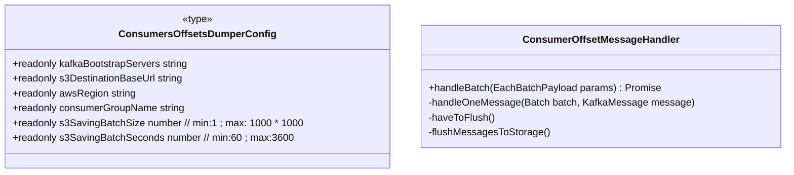
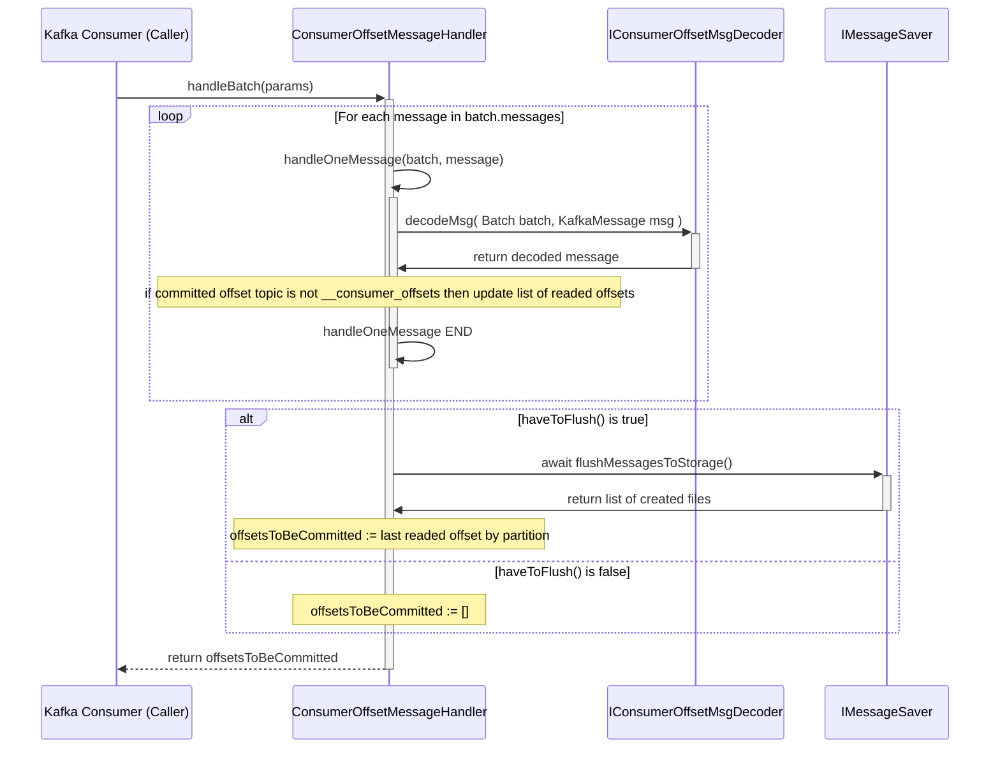

# ``dump-kafka-consumer_offsets-topic`` application design

This document describes the overall application design, including configuration,
message handling, and the application entrypoint. Persisted storage is supported
through S3 buckets.

## Class diagram

## Class responsibilities
 - __MessageEntry__ is a data structure that contains a JSON on one line and a 
   original message creation timestamp (ts); the timestamp is an epoch milliseconds number.
 - __IMessageSaver__ interface of classes used to save messages on some storage. The 
   only method _saveMessages_ get an URL and a list of messages. Can throw an error 
   if the URL is not supported. Return the list of created resources.
 - __S3MessageSaver__ support s3 like URLs and save JSON messages of one line into 
   S3 objects with key in the form ``<URL-path>/kind=<kindField>/year=<timestamp-YYYY>/month=<timestamp-MM>/day=<timestamp-DD>/<UUID>.ndjson`` 
   into bucket ``<URL-domain>``. Where _kindField_ is the content of field named kind 
   in the JSON message; 'NONE' if the field is absent or empty.
   This class configure the ``AWS_REGION`` to use from environment variable with a default 
   of ``eu-south-1``.

## ConsumerOffsetMessageHandler::handleBatch sequence diagram

## index runConsumer
This is the entrypoint of the containerized application it simply

 - Parse environment variables using [zod](https://www.npmjs.com/package/zod)
 - Initialize [pino](https://github.com/pinojs/pino) logger.
 - Connect to kafka to consume ``__consumer_offsets`` topic using 
   [confluent kafka client library](https://docs.confluent.io/kafka-clients/javascript/current/overview.html).
 - Configure shutdown hook.
 - Start consuming batch manually handling offset commit; use an instance of 
   ``ConsumerOffsetMessageHandler``.
