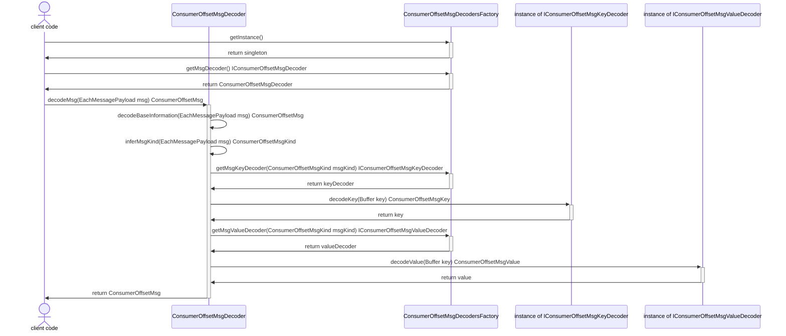

# ```msg-decoder``` package design

This package has to perform the task of transforming a class ```EachMessagePayload``` object
into an object of class ```ConsumerOffsetMsg```.

## Class diagram

```mermaid
classDiagram
    direction LR

    class IConsumerOffsetMsgDecoder {
        <<interface>>
        +decodeMsg( Batch batch, KafkaMessage msg ) ConsumerOffsetMsg
    }
    IConsumerOffsetMsgDecoder .. RawConsumerOffsetTopicMsg: transform from
    IConsumerOffsetMsgDecoder .. ConsumerOffsetMsg: transform to
    class IConsumerOffsetMsgKeyDecoder {
        <<interface>>
        +decodeKey(Buffer key) ConsumerOffsetMsgKey
    }
    class IConsumerOffsetMsgValueDecoder {
        <<interface>>
        +decodeValue(Buffer value) ConsumerOffsetMsgValue
    }

    class ConsumerOffsetMsgDecoder {
        -readonly decodersFactory ConsumerOffsetMsgDecodersFactory

        +decodeMsg( Batch batch, KafkaMessage msg ) ConsumerOffsetMsg 
        -inferMsgKind(EachMessagePayload msg) ConsumerOffsetMsgKind 
        -decodeBaseInformation(EachMessagePayload msg) ConsumerOffsetMsg
    }
    IConsumerOffsetMsgDecoder <|-- ConsumerOffsetMsgDecoder : implements
    ConsumerOffsetMsgDecoder .. IConsumerOffsetMsgKeyDecoder : use
    ConsumerOffsetMsgDecoder .. IConsumerOffsetMsgValueDecoder : use

    class OffsetCommitKeyAndValueDecoder {

    }
    IConsumerOffsetMsgKeyDecoder <|-- OffsetCommitKeyAndValueDecoder : implements
    IConsumerOffsetMsgValueDecoder <|-- OffsetCommitKeyAndValueDecoder : implements
    
    class GroupMetadataKeyAndValueDecoder {

    }
    IConsumerOffsetMsgKeyDecoder <|-- GroupMetadataKeyAndValueDecoder : implements
    IConsumerOffsetMsgValueDecoder <|-- GroupMetadataKeyAndValueDecoder : implements

    class UnknownKeyAndValueDecoder {

    }
    IConsumerOffsetMsgKeyDecoder <|-- UnknownKeyAndValueDecoder : implements
    IConsumerOffsetMsgValueDecoder <|-- UnknownKeyAndValueDecoder : implements

    
    class ConsumerOffsetMsgDecodersFactory {
        +getInstance$() ConsumerOffsetMsgDecodersFactory
        +getMsgDecoder() IConsumerOffsetMsgDecoder
        +getMsgKeyDecoder(ConsumerOffsetMsgKind msgKind) IConsumerOffsetMsgKeyDecoder
        +getMsgValueDecoder(ConsumerOffsetMsgKind msgKind) IConsumerOffsetMsgValueDecoder
    }
    ConsumerOffsetMsgDecodersFactory .. IConsumerOffsetMsgDecoder: build
    ConsumerOffsetMsgDecodersFactory .. IConsumerOffsetMsgKeyDecoder: build
    ConsumerOffsetMsgDecodersFactory .. IConsumerOffsetMsgValueDecoder: build

    
    class ConsumerOffsetMsg {
        <<type>>
        +readonly number consumerOffsetTopicPartition
        +readonly number msgTimestampEpoch
        +readonly number msgOffset
        +readonly number msgSize
        +readonly ConsumerOffsetMsgKind kind
        +readonly ConsumerOffsetMsgKey key
        +readonly ConsumerOffsetMsgValue value
    }
    ConsumerOffsetMsg *-- ConsumerOffsetMsgKey : key
    ConsumerOffsetMsg *-- ConsumerOffsetMsgKind : kind
    ConsumerOffsetMsg *-- ConsumerOffsetMsgValue : value
    
    class ConsumerOffsetMsgKind {
        <<enumeration>>
        OFFSET_COMMIT
        GROUP_METADATA
        UNKNOWN
    }

    class ConsumerOffsetMsgKey {
        <<union>>
    }
    ConsumerOffsetMsgKey <|-- OffsetCommitMsgKey : is a
    ConsumerOffsetMsgKey <|-- GroupMetadataMsgKey : is a
    ConsumerOffsetMsgKey <|-- UnknownMsgKey : is a
    class UnknownMsgKey {
        <<type>>
        +"UNKNOWN" discriminator
        +readonly number version
    }
    class OffsetCommitMsgKey {
        <<type>>
        +"OFFSET_COMMIT" discriminator
        +readonly number version
        +readonly string groupId
        +readonly string topic
        +readonly number partition
    }
    class GroupMetadataMsgKey {
        <<type>>
        +"GROUP_METADATA" discriminator
        +readonly number version
        +readonly string groupId
        +readonly string topic [0..1]
        +readonly number partition [0..1]
    }


    class ConsumerOffsetMsgValue {
        <<union>>
    }
    ConsumerOffsetMsgValue <|-- OffsetCommitMsgValue : is a
    ConsumerOffsetMsgValue <|-- GroupMetadataMsgValue : is a
    ConsumerOffsetMsgValue <|-- UnknownMsgValue : is a
    class UnknownMsgValue {
        <<type>>
        +"UNKNOWN" discriminator
        +readonly number version
    }
    class OffsetCommitMsgValue {
        <<type>>
        +"OFFSET_COMMIT" discriminator
        +readonly number version
        +readonly bigint offset?
        +readonly number leaderEpoch [0..1]
        +readonly string|null metadata [0..1]
        +readonly bigint commitTimestamp [0..1]
        +readonly bigint expireTimestamp [0..1]
    }
    class GroupMetadataMsgValue {
        <<type>>
        +"GROUP_METADATA" discriminator
        +readonly number version
        +readonly string|null protocolType [0..1]
        +readonly number generation [0..1]
        +readonly string|null protocol [0..1]
        +readonly string|null leader [0..1]
        +readonly bigint currentStateTimestamp [0..1]
    }
    GroupMetadataMsgValue *-- GroupMetadataMember : members [0..*]

    class GroupMetadataMember {
        <<type>>
        +readonly string|null memberId
        +readonly string|null groupInstanceId [0..1]
        +readonly string|null clientId
        +readonly string|null clientHost
        +readonly number rebalanceTimeout
        +readonly number sessionTimeout
    }
```


## Class responsibilities

- __EachMessagePayload__ is the interface of the first parameter of the ```eachMessage``` callback
  of the ```Consumer::run``` method in the "@confluentinc/kafka-javascript" library. That library 
  is used to read messages from kafka ```__consumer_offsets``` internal topic.

- __ConsumerOffsetMsg__ is the type describing the data structure of the information that this 
  package extract from the original kafka payload. This structure has two fields, ```key``` and
  ```value```, represented by a _union_ type; the ```kind``` field determine the exact 
  specialization of the union type.

- __ConsumerOffsetMsgKind__ is an enumeration used to distinguish different messages categories:
  - ```OFFSET_COMMIT``` for messages that inform about a kafka consumer group offset commit.
  - ```GROUP_METADATA``` for metadata like consumer group rebalancing and others meta-information
    about a consumer group.
  - ```UNKNOWN``` all messages do not recognized by this software package.

- The kafka message key Buffer is decoded into __ConsumerOffsetMsgKey__ that is a union type 
  with the following specialization:
  - ```OffsetCommitMsgKey``` used when the message kind is ```OFFSET_COMMIT```
  - ```GroupMetadataMsgKey``` used when the message kind is ```GROUP_METADATA```
  - ```UnknownMsgKey``` used when the message kind is ```UNKNOWN```

- The kafka message value Buffer is decoded into __ConsumerOffsetMsgValue__ that is a union type 
  with the following specialization:
  - ```OffsetCommitMsgValue``` used when the message kind is ```OFFSET_COMMIT```
  - ```GroupMetadataMsgValue``` used when the message kind is ```GROUP_METADATA```
  - ```UnknownMsgValue``` used when the message kind is ```UNKNOWN```

- Interfaces __IConsumerOffsetMsgDecoder__, __IConsumerOffsetMsgKeyDecoder__ and 
  __IConsumerOffsetMsgValueDecoder__ are three abstraction used to split the message transformation
  task. An instance of ```IConsumerOffsetMsgDecoder``` transform an ```EachMessagePayload``` 
  instance into an object of type ```ConsumerOffsetMsg``` delegating the decoding of the 
  ```Buffer``` nested fields, ```message.key```, and ```message.value``` to instances of the two 
  interfaces ```IConsumerOffsetMsgKeyDecoder``` and ```IConsumerOffsetMsgValueDecoder``` 
  respectively. 
  ```IConsumerOffsetMsgDecoder``` instances have to use class ```ConsumerOffsetMsgDecodersFactory```
  to instantiate other interface instances.

- Class __ConsumerOffsetMsgDecodersFactory__ has a static getInstance no-args method that
  return a singleton instance. That singleton is the entry point to get instances of 
  ``` IConsumerOffsetMsgDecoder```, ```IConsumerOffsetMsgKeyDecoder``` and 
  ```IConsumerOffsetMsgValueDecoder``` interfaces.

- the __OffsetCommitKeyAndValueDecoder__, __GroupMetadataKeyAndValueDecoder__ and 
  __UnknownKeyAndValueDecoder__ classes have the methods and the code useful to decode the 
  ```Buffer``` of ```key``` and ```value``` fields of the kafka ```__consumer_offsets``` topic. 
  The exact decoder is discriminated by the ```kind``` field of the message.

- the class __ConsumerOffsetMsgDecoder__ contains the code to coordinate the transformation
  (decoding) process. The entry-point method of this class is 
  ```decodeMsg(EachMessagePayload msg)```, the sequence of this method is reported in the next
  chapter.


## Message transformation sequence
